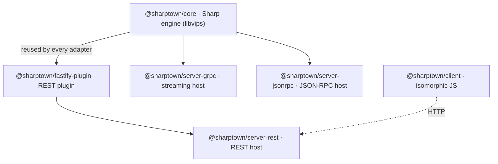

# Architecture

Sharptown is a pnpm monorepo built around one principle: **all image work lives in a
single framework-agnostic engine, and every transport is a thin adapter on top of it.**

## The big picture



## The core engine — `@sharptown/core`

The heart of the project. It depends on **no web framework**; it just knows how to drive
Sharp. Two entry points cover both processing styles:

- **`transformBuffer(input, options)`** — transforms an in-memory buffer and returns
  `{ data, format, contentType }`. Used by REST and JSON-RPC.
- **`createTransformStream(options)`** — returns a Sharp duplex stream configured for
  arbitrary-size files (`sequentialRead`, no input-pixel limit). Used by gRPC.

Both funnel through **`applyOperations(image, options)`**, the one function that maps your
parameters (`width`, `blur`, `convertTo`, …) onto Sharp calls. Because every adapter
reuses it, the behavior is identical no matter which transport you hit.

```js
import { transformBuffer } from '@sharptown/core'

const { data, contentType } = await transformBuffer(inputBuffer, {
  width: 800,
  convertTo: 'webp',
})
```

Invalid values raise an **`InvalidOperationError`**, which each adapter maps to its own
error convention (HTTP 400, gRPC `INVALID_ARGUMENT`, JSON-RPC `-32602`).

## The transport adapters

| Adapter | Style | Best for |
| ------- | ----- | -------- |
| **REST** (`@sharptown/fastify-plugin` → `server-rest`) | `multipart` upload, binary response | Web apps, CDNs, `curl`, the JS client. |
| **gRPC** (`server-grpc`) | Bidirectional streaming | Huge files, service-to-service, backpressure. |
| **JSON-RPC** (`server-jsonrpc`) | JSON-RPC 2.0 over WebSocket, base64 | Persistent socket apps, batching, notifications. |

Each adapter is small precisely because the core does the real work. Adding a new one
(Hono, Elysia, Express…) means: read the input, call `transformBuffer`, send the bytes,
map `InvalidOperationError` to an error.

## The clients

Sharptown ships clients in **JavaScript, PHP, Go and Elixir**, all sharing the same
chainable API and canonical operation set, with a **pluggable transport** design. Only the
JS client is published to npm; the PHP, Go and Elixir clients live under `clients/<language>`
in the repository. See [JS](/docs/js-client), [PHP](/docs/php-client), [Go](/docs/go-client)
and [Elixir](/docs/elixir-client).

## Design choices worth knowing

- **Self-documenting code, JSDoc on the public API.** Every exported function carries an
  `@example`.
- **Streaming never buffers whole files.** The gRPC path pipes chunks straight into Sharp
  and out again, so memory stays flat even for multi-gigabyte inputs.
- **Format detection from Sharp's own output.** The response `Content-Type` is correct
  even when you do not pass `convertTo`.
