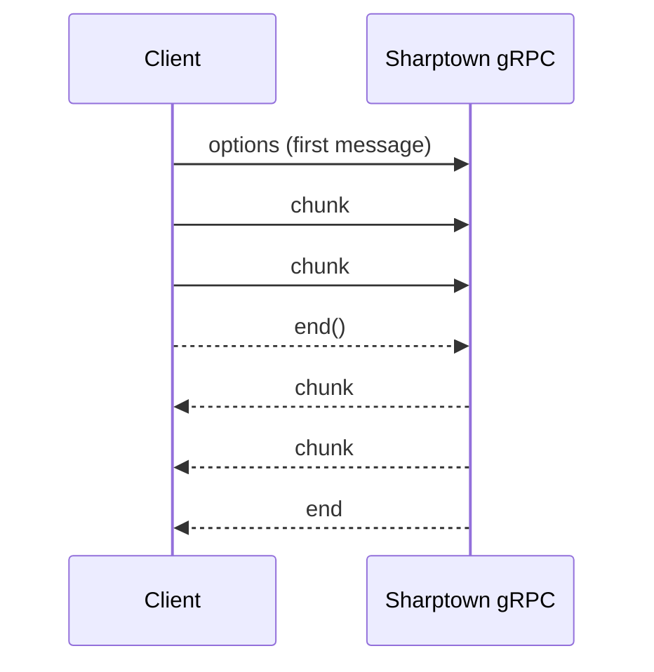

# gRPC API

Alongside REST, Sharptown exposes a gRPC service `ImageProcessor` with **bidirectional
streaming**. It is designed for files of **any size** — for example a `~3 GB` PNG map
converted to WebP/JPEG.

Data is sent in chunks and **never fully assembled in memory**: the input stream is piped
straight into Sharp, and the result is streamed back as chunks. Backpressure is respected
in both directions.

It is served by `@sharptown/server-grpc` on port **50051** by default
(`SHARPTOWN_GRPC_PORT` / `SHARPTOWN_GRPC_HOST`).

## The contract

The proto lives at `packages/server-grpc/proto/sharptown.proto`:

```proto
service ImageProcessor {
  // First message — options; subsequent messages — byte chunks.
  rpc Transform(stream TransformRequest) returns (stream TransformResponse);
}

message TransformOptions {
  optional uint32 width        = 1;
  optional uint32 height       = 2;
  optional int32  rotate       = 3;
  bool            flip         = 4;
  optional uint32 blur         = 5;
  optional uint32 tint_r       = 6;
  optional uint32 tint_g       = 7;
  optional uint32 tint_b       = 8;
  bool            grayscale    = 9;
  bool            remove_alpha = 10;
  bool            ensure_alpha = 11;
  string          convert_to   = 12; // webp/png/jpg/jpeg/avif/gif/heif; empty = keep
}

message TransformRequest {
  oneof payload {
    TransformOptions options = 1; // exactly the first message
    bytes            chunk   = 2; // subsequent data messages
  }
}

message TransformResponse {
  bytes chunk = 1;
}
```

`TransformOptions` is at parity with REST `/api/v1/transform` — the field names just use
the proto convention (`tint_r`, `remove_alpha`, `convert_to`).

## The streaming protocol

1. Open the `Transform` stream.
2. Send **exactly one** `options` message first.
3. Send the source file as a sequence of `chunk` messages.
4. Call `end()` on the client stream.
5. Read the transformed image back as a sequence of `chunk` messages until `end`.



## Run it

```bash
pnpm install
cp .env.example .env
pnpm grpc        # dev (watch)
```

## Node.js client example

```js
import * as grpc from '@grpc/grpc-js'
import protoLoader from '@grpc/proto-loader'
import { createReadStream, createWriteStream } from 'node:fs'

const def = protoLoader.loadSync('packages/server-grpc/proto/sharptown.proto', {
  keepCase: false, oneofs: true, defaults: true,
})
const { sharptown } = grpc.loadPackageDefinition(def)
const client = new sharptown.v1.ImageProcessor(
  'localhost:50051',
  grpc.credentials.createInsecure(),
)

const out = createWriteStream('map.webp')
const call = client.Transform()
call.on('data', ({ chunk }) => out.write(chunk))
call.on('end', () => out.end())

// 1) options, then 2) the source byte stream
call.write({ options: { width: 4096, convertTo: 'webp' } })
const src = createReadStream('map-3gb.png')
src.on('data', (chunk) => call.write({ chunk }))
src.on('end', () => call.end())
```

## Notes on large files

Memory stays flat thanks to streaming plus `sequentialRead`. Mind the output-format
pixel limits (WebP `16383²`, JPEG `65535²`) covered in the
[Operations reference](/docs/operations#big-file-limits-streaming--grpc). For
gigabyte-scale maps prefer `resize` / `convert` / `flip`; arbitrary `rotate` can cost
more memory.
