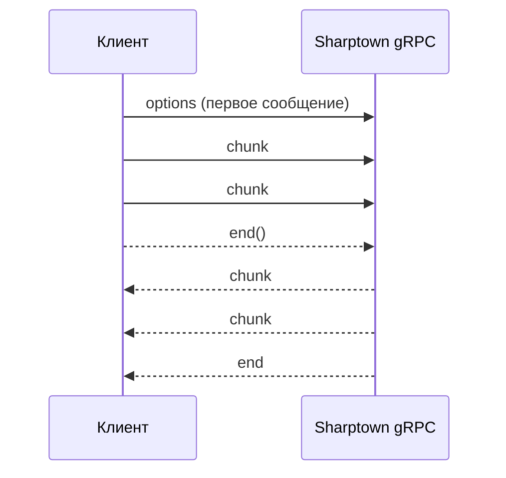

# gRPC API

Помимо REST, Sharptown предоставляет gRPC-сервис `ImageProcessor` с **двунаправленным
стримингом**. Он спроектирован под файлы **любого размера** — например, PNG-карта `~3 ГБ`,
конвертируемая в WebP/JPEG.

Данные передаются чанками и **никогда не собираются целиком в память**: входной поток
пайпится прямо в Sharp, а результат отдаётся обратно потоком чанков. Backpressure
соблюдается в обе стороны.

Его обслуживает `@sharptown/server-grpc` на порту **50051** по умолчанию
(`SHARPTOWN_GRPC_PORT` / `SHARPTOWN_GRPC_HOST`).

## Контракт

Proto-файл лежит в `packages/server-grpc/proto/sharptown.proto`:

```proto
service ImageProcessor {
  // Первое сообщение — options, последующие — чанки байт.
  rpc Transform(stream TransformRequest) returns (stream TransformResponse);
}

message TransformOptions {
  optional uint32 width        = 1;
  optional uint32 height       = 2;
  optional int32  rotate       = 3;
  bool            flip         = 4;
  optional uint32 blur         = 5;
  optional uint32 tint_r       = 6;
  optional uint32 tint_g       = 7;
  optional uint32 tint_b       = 8;
  bool            grayscale    = 9;
  bool            remove_alpha = 10;
  bool            ensure_alpha = 11;
  string          convert_to   = 12; // webp/png/jpg/jpeg/avif/gif/heif; пусто = без изменений
}

message TransformRequest {
  oneof payload {
    TransformOptions options = 1; // ровно первое сообщение
    bytes            chunk   = 2; // последующие сообщения с данными
  }
}

message TransformResponse {
  bytes chunk = 1;
}
```

`TransformOptions` паритетен REST `/api/v1/transform` — отличаются лишь имена полей по
соглашению proto (`tint_r`, `remove_alpha`, `convert_to`).

## Протокол стриминга

1. Откройте поток `Transform`.
2. Отправьте **ровно одно** сообщение `options` первым.
3. Отправьте исходный файл последовательностью сообщений `chunk`.
4. Вызовите `end()` на клиентском потоке.
5. Читайте обратно трансформированное изображение последовательностью `chunk` до `end`.



## Запуск

```bash
pnpm install
cp .env.example .env
pnpm grpc        # dev (watch)
```

## Пример клиента на Node.js

```js
import * as grpc from '@grpc/grpc-js'
import protoLoader from '@grpc/proto-loader'
import { createReadStream, createWriteStream } from 'node:fs'

const def = protoLoader.loadSync('packages/server-grpc/proto/sharptown.proto', {
  keepCase: false, oneofs: true, defaults: true,
})
const { sharptown } = grpc.loadPackageDefinition(def)
const client = new sharptown.v1.ImageProcessor(
  'localhost:50051',
  grpc.credentials.createInsecure(),
)

const out = createWriteStream('map.webp')
const call = client.Transform()
call.on('data', ({ chunk }) => out.write(chunk))
call.on('end', () => out.end())

// 1) options, затем 2) поток байт исходника
call.write({ options: { width: 4096, convertTo: 'webp' } })
const src = createReadStream('map-3gb.png')
src.on('data', (chunk) => call.write({ chunk }))
src.on('end', () => call.end())
```

## Заметки о больших файлах

Память остаётся плоской благодаря стримингу плюс `sequentialRead`. Учитывайте пиксельные
лимиты форматов вывода (WebP `16383²`, JPEG `65535²`), описанные в
[справочнике операций](/ru/docs/operations#лимиты-для-больших-файлов-стриминг--grpc). Для
гигабайтных карт предпочтительны `resize` / `convert` / `flip`; произвольный `rotate`
может стоить больше памяти.
